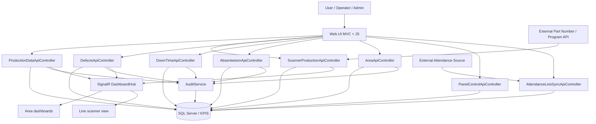
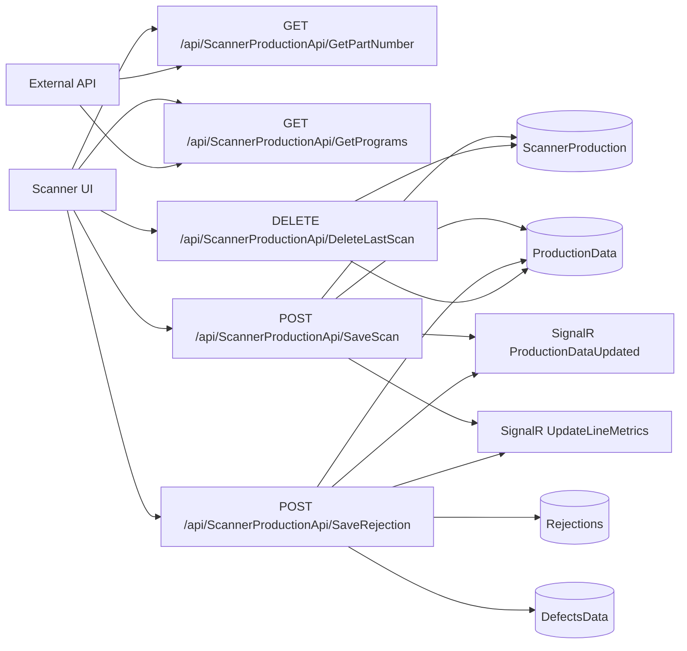
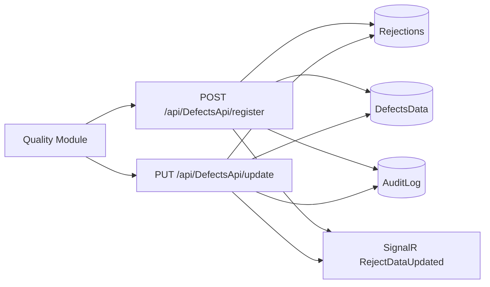
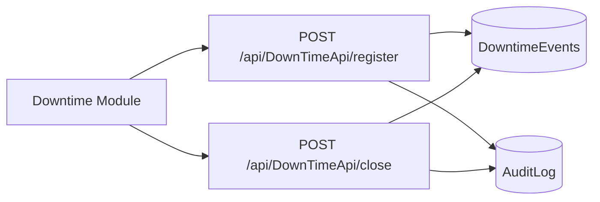
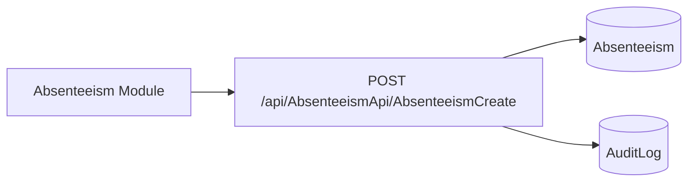
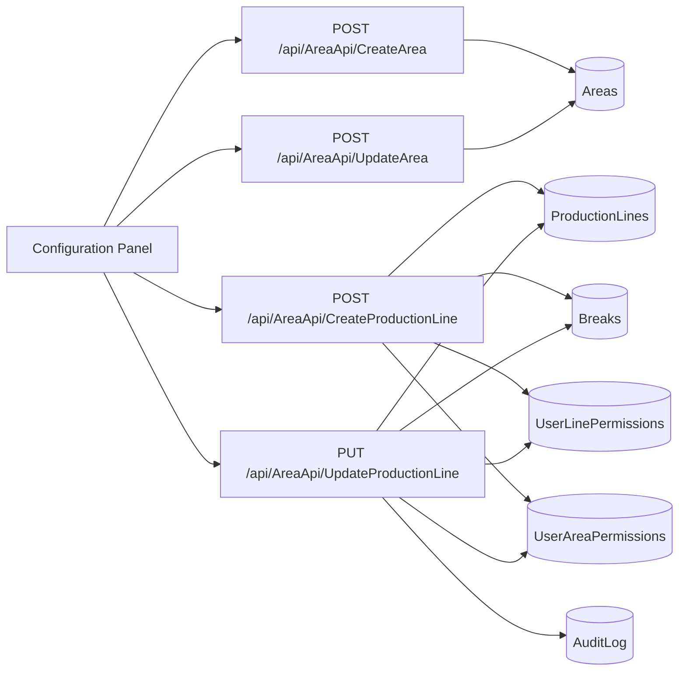
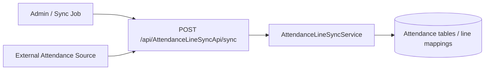

# API Flow Diagram

This diagram shows the main APIs that send information into the system, the external dependencies the application consults, and how the data ends up in the database and real-time dashboards.

## General flow



## APIs that input data into the system

### 1. Manual production entry

```mermaid
flowchart LR
    A[Production Form] --> B[POST /api/ProductionDataApi]
    A --> C[PUT /api/ProductionDataApi/{id}]
    A --> D[POST /api/ProductionDataApi/UpdateProducedPieces]
    B --> E[(ProductionData)]
    C --> E
    D --> E
    B --> F[(AuditLog)]
    C --> F
    D --> F
    B --> G[SignalR RequirementUpdated]
    C --> G
    D --> G
```

### 2. Production scanner



### 3. Defects / quality registration



### 4. Downtime



### 5. Absenteeism



### 6. Area and line setup



### 7. Attendance synchronization



## Summary of the most important input endpoints

| API | Endpoint | Input type | Main destination |
| --- | --- | --- | --- |
| `ProductionDataApiController` | `POST /api/ProductionDataApi` | Manual production entry | `ProductionData`, auditing, SignalR |
| `ProductionDataApiController` | `PUT /api/ProductionDataApi/{id}` | Manual update | `ProductionData`, auditing, SignalR |
| `ProductionDataApiController` | `POST /api/ProductionDataApi/UpdateProducedPieces` | Quick piece adjustment | `ProductionData`, auditing, SignalR |
| `ScannerProductionApiController` | `POST /api/ScannerProductionApi/SaveScan` | Piece scan | `ScannerProduction`, `ProductionData`, SignalR |
| `ScannerProductionApiController` | `POST /api/ScannerProductionApi/SaveRejection` | Rejection from scanner | `Rejections`, `DefectsData`, `ProductionData`, SignalR |
| `DefectsApiController` | `POST /api/DefectsApi/register` | Defect capture | `Rejections`, `DefectsData`, auditing, SignalR |
| `DefectsApiController` | `PUT /api/DefectsApi/update` | Defect editing | `Rejections`, `DefectsData`, auditing, SignalR |
| `DownTimeApiController` | `POST /api/DownTimeApi/register` | Downtime start | `DowntimeEvents`, auditing |
| `DownTimeApiController` | `POST /api/DownTimeApi/close` | Downtime close | `DowntimeEvents`, auditing |
| `AbsenteeismApiController` | `POST /api/AbsenteeismApi/AbsenteeismCreate` | Absenteeism entry | `Absenteeism`, auditing |
| `AreaApiController` | `POST /api/AreaApi/CreateArea` | Area creation | `Areas` |
| `AreaApiController` | `POST /api/AreaApi/CreateProductionLine` | Line creation | `ProductionLines`, `Breaks`, permissions |
| `AreaApiController` | `PUT /api/AreaApi/UpdateProductionLine` | Line editing | lines, breaks, permissions, auditing |
| `AttendanceLineSyncApiController` | `POST /api/AttendanceLineSyncApi/sync` | External synchronization | attendance service + database |

## Recommended usage

- If you want to show this on GitHub, link this file from `README.md`.
- If you want to present it, export only the first diagram and the `ScannerProductionApiController` flow, because that is the most complete operational path in the system.
