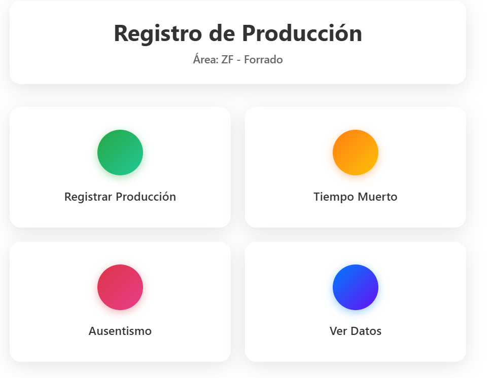
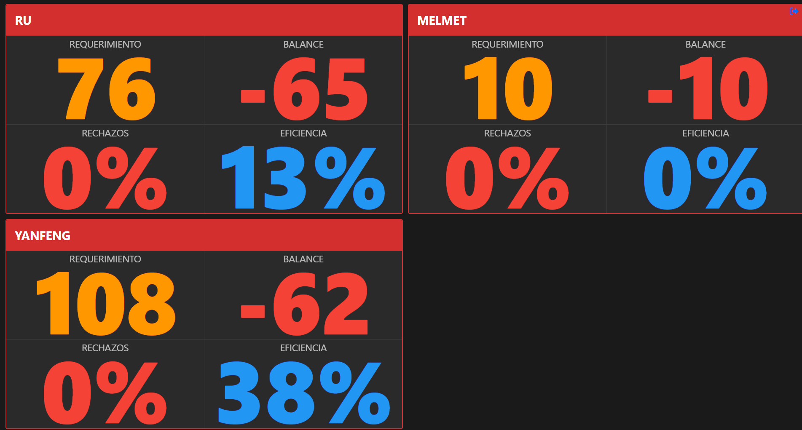
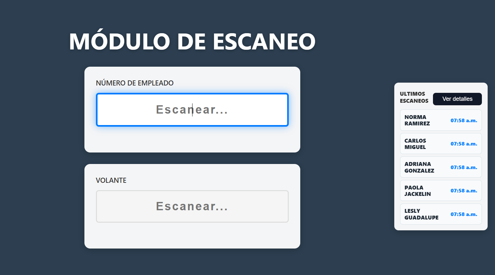
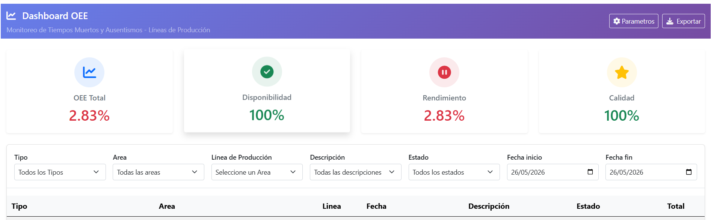
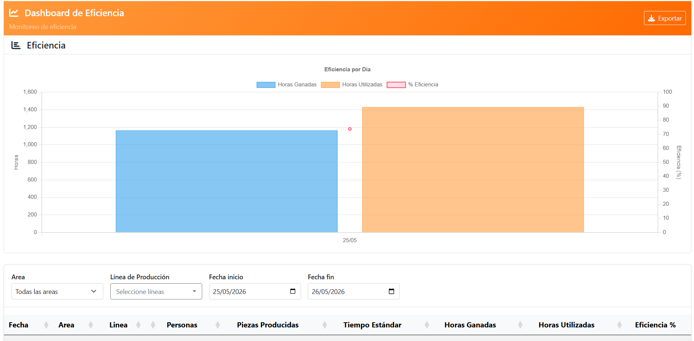
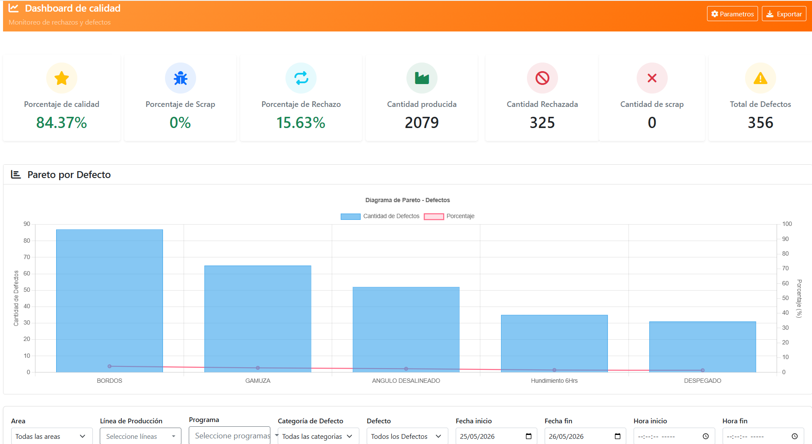
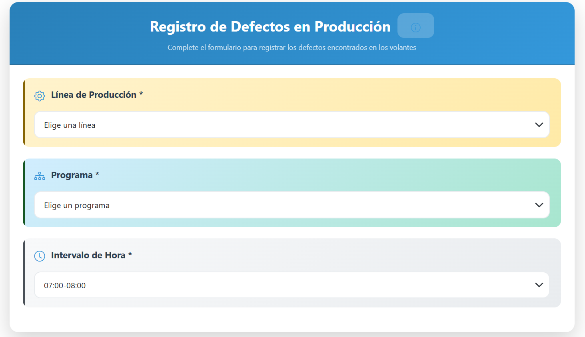
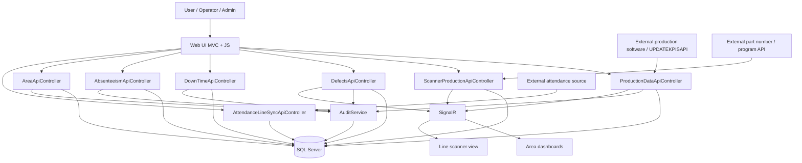

# Manufacturing KPI Platform

# Manufacturing KPI Platform

Real-time manufacturing KPI and production monitoring platform built with ASP.NET Core MVC, SQL Server, Entity Framework Core, and SignalR. The system centralizes production tracking, OEE monitoring, quality management, downtime analysis, attendance synchronization, and live operational dashboards.

## Stack

- .NET 8
- ASP.NET Core MVC
- Entity Framework Core + SQL Server
- SignalR
- JavaScript, jQuery, Bootstrap, and DataTables
- ClosedXML for Excel report export

## Main modules

- Production data entry and lookup
- Production registration from an external software through `UPDATEKPISAPI`
- Production scanner workflow
- Area-based production dashboard
- OEE and efficiency
- Quality and rejection tracking
- Attendance and absenteeism
- Control panel and area/line setup
- Excel reporting

## Screenshots

### Production register



### Production dashboard



### Production scanner



### OEE dashboard



### Efficiency dashboard



### Quality dashboard



### Defect registration



## General architecture

The project follows a traditional MVC structure:

- `GDIKPI/Controllers`: web views and UI flows
- `GDIKPI/ApiControllers`: endpoints for async operations and dashboards
- `GDIKPI/Data`: `DbContext` and entity mapping
- `GDIKPI/Models`: domain entities
- `GDIKPI/DTO`: data transfer objects
- `GDIKPI/Services`: business logic, auditing, permissions, schedulers, and reports
- `GDIKPI/Hubs`: real-time updates with SignalR
- `GDIKPI/Views`: Razor views
- `GDIKPI/wwwroot`: JavaScript, CSS, and static assets

## Data flow and APIs

The application receives information from operational web modules, external plant software integrations, and supporting APIs, then sends it to SQL Server, auditing, and real-time dashboards.



### Main system inputs

- `POST /api/ProductionDataApi`: manual production data entry
- External production registration from a separate software through `UPDATEKPISAPI`
- `PUT /api/ProductionDataApi/{id}`: production record update
- `POST /api/ProductionDataApi/UpdateProducedPieces`: quick piece-count adjustment
- `POST /api/ScannerProductionApi/SaveScan`: production scan registration
- `POST /api/ScannerProductionApi/SaveRejection`: rejection registration from the scanner
- `POST /api/DefectsApi/register`: quality defect capture
- `POST /api/DownTimeApi/register`: downtime start
- `POST /api/DownTimeApi/close`: downtime close
- `POST /api/AbsenteeismApi/AbsenteeismCreate`: absenteeism capture
- `POST /api/AreaApi/CreateArea` and `POST /api/AreaApi/CreateProductionLine`: operational setup input
- `POST /api/AttendanceLineSyncApi/sync`: attendance synchronization

Full flow details are available in [DIAGRAMA_FLUJO_APIS.md](./FLOWCHART_APIS.md).

## Local setup

### Requirements

- .NET 8 SDK
- Accessible SQL Server instance

### Steps

1. Clone the repository.
2. Create a local configuration for the connection string.
3. Restore dependencies:

```bash
dotnet restore GDIKPI.sln
```

4. Run the application:

```bash
dotnet run --project GDIKPI/GDIKPI.csproj --launch-profile http
```

5. Open:

```text
http://localhost:5016
```

## Configuration

The application uses `appsettings.json` for connection strings and external API settings. For a shareable or public version, secrets should be moved to:

- environment variables
- `dotnet user-secrets`
- a non-versioned local configuration file

## What this project demonstrates

- Integration of multiple manufacturing business modules in a single application
- Entity Framework Core usage with queries, views, and stored procedures
- Operational dashboards with real-time updates through SignalR
- Full-stack workflow implementation in ASP.NET Core MVC
- KPI reporting for manufacturing operations

## Current state

This project was developed as an internal business application. Before publishing it as a strong portfolio piece, I recommend sanitizing and hardening it:

- remove credentials and sensitive data
- strengthen authentication and authorization
- remove insecure development configuration
- add automated tests
- move heavy business logic out of controllers

## Portfolio note

If this repository is going to be public, the best positioning is:

- an internal manufacturing KPI system
- a real-world example of backend, UI, database, and real-time integration
- a project being refactored toward stronger engineering practices

That presents it better than trying to frame it as already production-ready for public distribution.
