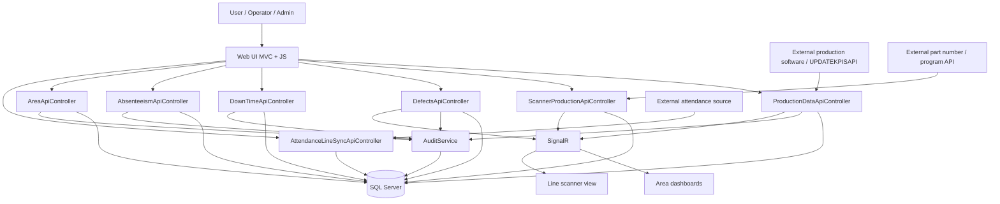

# Manufacturing KPI Platform

Real-time manufacturing KPI and production monitoring platform built with ASP.NET Core MVC, SQL Server, Entity Framework Core, and SignalR. The system centralizes production tracking, OEE monitoring, quality management, downtime analysis, attendance synchronization, and live operational dashboards.

## About this repository

This is the public portfolio version of GDIKPI, an internal manufacturing application maintained in a separate private repository. The solution and application retain the GDIKPI name. This repository documents the implementation with local configuration examples; it does not include the private repository's Git history or production database.

## Latest update

- Production dashboard card visibility and ordering, with persisted settings and live updates.
- Production-line scanning with line validation, recent scans, quantity handling, inactivity timeout, and synchronized scanner feedback through SignalR.
- Operator-to-line assignments and expanded operator dashboard reporting.
- Configurable scanner prefix/suffix validation and external part-number API endpoints.

See [CHANGELOG.md](./CHANGELOG.md) for the update summary and database upgrade notes.

## Stack

- .NET 8
- ASP.NET Core MVC
- Entity Framework Core + SQL Server
- SignalR
- JavaScript, jQuery, Bootstrap, and DataTables
- ClosedXML for Excel report export

## Main modules

- Production data entry and lookup
- Production registration from an external software through `UPDATEKPISAPI`
- Production scanner workflow
- Area-based production dashboard
- OEE and efficiency
- Quality and rejection tracking
- Attendance and absenteeism
- Control panel and area/line setup
- Excel reporting

## Screenshots

### Production register


### Production dashboard


### Production scanner


### OEE dashboard


### Efficiency dashboard


### Quality dashboard


### Defect registration


## General architecture

The project follows a traditional MVC structure:

- `GDIKPI/Controllers`: web views and UI flows
- `GDIKPI/ApiControllers`: endpoints for async operations and dashboards
- `GDIKPI/Data`: `DbContext` and entity mapping
- `GDIKPI/Models`: domain entities
- `GDIKPI/DTO`: data transfer objects
- `GDIKPI/Services`: business logic, auditing, permissions, schedulers, and reports
- `GDIKPI/Hubs`: real-time updates with SignalR
- `GDIKPI/Views`: Razor views
- `GDIKPI/wwwroot`: JavaScript, CSS, and static assets

## Data flow and APIs

The application receives information from operational web modules, external plant software integrations, and supporting APIs, then sends it to SQL Server, auditing, and real-time dashboards.



### Main system inputs

- `POST /api/ProductionDataApi`: manual production data entry
- External production registration from a separate software through `UPDATEKPISAPI`
- `PUT /api/ProductionDataApi/{id}`: production record update
- `POST /api/ProductionDataApi/UpdateProducedPieces`: quick piece-count adjustment
- `POST /api/ScannerProductionApi/SaveScan`: production scan registration
- `POST /api/ScannerProductionApi/SaveRejection`: rejection registration from the scanner
- `POST /api/DefectsApi/register`: quality defect capture
- `POST /api/DownTimeApi/register`: downtime start
- `POST /api/DownTimeApi/close`: downtime close
- `POST /api/AbsenteeismApi/AbsenteeismCreate`: absenteeism capture
- `POST /api/AreaApi/CreateArea` and `POST /api/AreaApi/CreateProductionLine`: operational setup input
- `POST /api/AttendanceLineSyncApi/sync`: attendance synchronization

Full flow details are available in [DIAGRAMA_FLUJO_APIS.md](./FLOWCHART_APIS.md).

## Local setup

### Requirements

- .NET 8 SDK
- Accessible SQL Server instance
- Windows for operator report graphics that rely on `System.Drawing`.

### Steps

1. Clone the repository.
2. Provision a development SQL Server database with the application's existing schema, views, stored procedures, and synthetic reference data. The scripts in `GDIKPI/Scripts` are incremental changes, not a complete database bootstrap. Review the upgrade notes in [CHANGELOG.md](./CHANGELOG.md).
3. Configure the connection and external services using environment variables. The checked-in values target localhost and contain no database password. For example, in PowerShell:

```powershell
$env:ConnectionStrings__DefaultConnection = "Server=localhost;Database=ManufacturingKpiDemo;Integrated Security=true;TrustServerCertificate=true;MultipleActiveResultSets=True;"
$env:ExternalApi__BaseUrl = "http://localhost:9091"
$env:AttendanceApi__BaseUrl = "http://localhost:9092"
```

These API addresses are placeholders for separately supplied services; those services are not included in this repository.

4. Restore dependencies:

```bash
dotnet restore GDIKPI.sln
```

5. Run the application:

```bash
dotnet run --project GDIKPI/GDIKPI.csproj --launch-profile http
```

6. Open:

```text
http://localhost:5016
```

## Configuration

The application uses `appsettings.json` and ASP.NET Core environment-variable overrides:

- `ConnectionStrings__DefaultConnection`: development SQL Server connection.
- `ExternalApi__BaseUrl`: part-number and production-program service.
- `AttendanceApi__BaseUrl`: attendance service.
- `ScannerValidation__ZF__Enabled`: enables configurable prefix/suffix checks. The committed values are synthetic examples and validation is disabled by default.
- `ProductionLineScanner__BatchInactivitySeconds`: scanner inactivity timeout (60 seconds by default).

Generated dashboard preferences in `GDIKPI/App_Data` and local production configuration files are excluded from Git. Employee seed records are excluded from the public SQL script. Do not commit credentials or operational datasets.

## What this project demonstrates

- Integration of multiple manufacturing business modules in a single application
- Entity Framework Core usage with queries, views, and stored procedures
- Operational dashboards with real-time updates through SignalR
- Full-stack workflow implementation in ASP.NET Core MVC
- KPI reporting for manufacturing operations

## Current state

This codebase demonstrates an internal manufacturing application and remains under active development. Running the complete workflows requires a compatible SQL Server schema and external services. The public repository is not a self-contained demo or a hardened public deployment.

Engineering priorities include automated regression tests, consistent endpoint authorization, production TLS configuration, and extracting complex controller logic into services. The attendance HTTP client currently bypasses certificate validation and must be hardened before a production deployment.

## Portfolio note

The portfolio focuses on manufacturing workflows, backend and database integration, operational interfaces, and real-time visibility. Screenshots illustrate the documented workflows and may differ from the latest interface.
